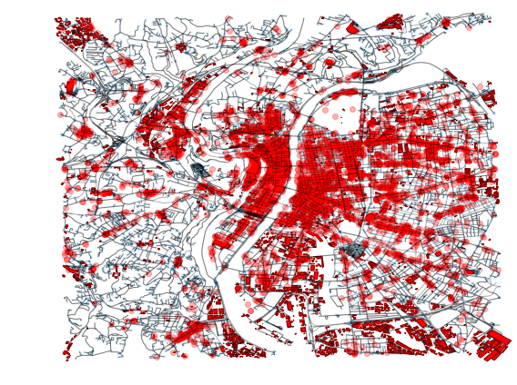
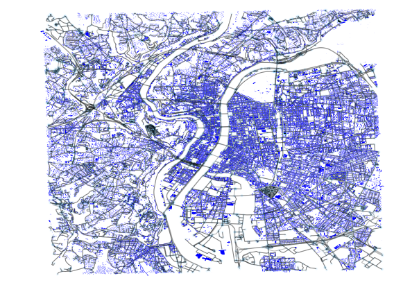

# Urbansprawl

The urbansprawl project provides an open framework to assess the urban sprawl phenomenon.
It uses OpenStreetMap data to calculate its sprawling indices, divided in Accessibility, Land use mix, and Dispersion.


**For more details, refer to:**

* Gervasoni Luciano, Bosch Martí, Fenet Serge, and Sturm Peter. 2016. "[A framework for evaluating urban land use mix from crowd-sourcing data](https://hal.inria.fr/hal-01396792)." 2nd International Workshop on Big Data for Sustainable Development.

* Gervasoni Luciano, Bosch Martí, Fenet Serge, and Sturm Peter. 2017. "[LUM_OSM: une plateforme pour l'évaluation de la mixité urbaine à partir de données participatives](https://hal.inria.fr/hal-01548341)." GAST Workshop, Conférence Extraction et Gestion de Connaissances (EGC 2017).

* Gervasoni Luciano, Bosch Martí, Fenet Serge, and Sturm Peter. 2017. "[Calculating spatial urban sprawl indices using open data](https://hal.inria.fr/hal-01535469)." 15th International Conference on Computers in Urban Planning and Urban Management.

NOTE: The implementation for the previous publications can be found at version 1.0

## Dependencies

urbansprawl works with Python 2+3.

- Python dependencies:
```sh
osmnx scikit-learn
```

* Using anaconda:
```sh
conda update -c conda-forge --all
conda install -c conda-forge osmnx scikit-learn
```

## Example

OpenStreetMap data is retrieved using the Overpass API.

Results are depicted for the city of **Lyon, France**:

- Locations of residential and activity land uses are retrieved

* Activity uses:



* Residential uses:



- Densities for each land use are estimated:


* Activity uses can be further classified:


- Street network:


**Sprawling indices:**

- Land use mix indices:


- Accessibility indices:


- Dispersion indices:


