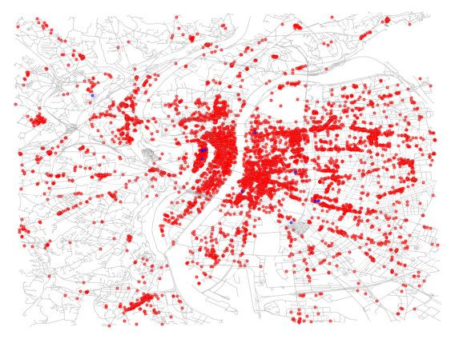
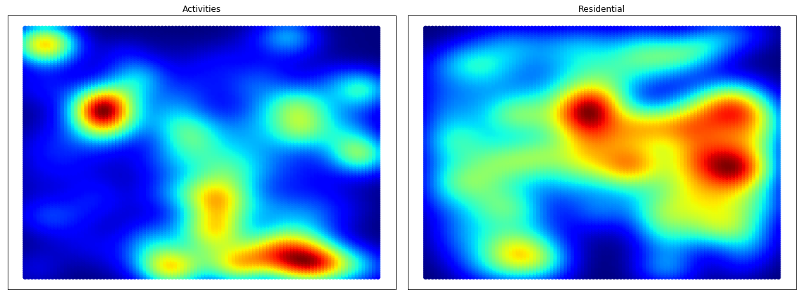
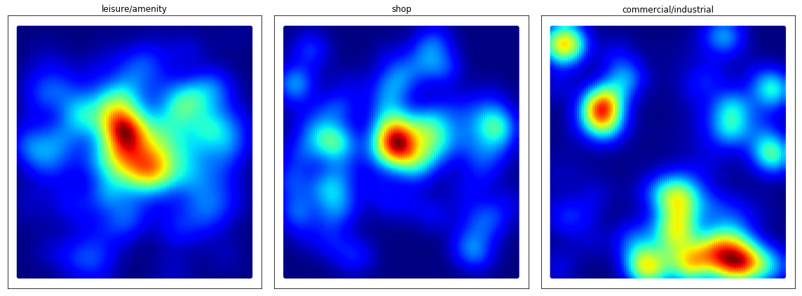
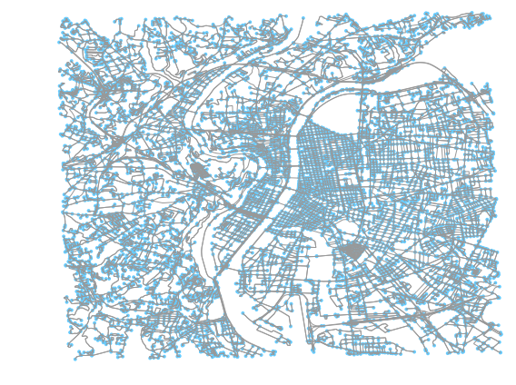
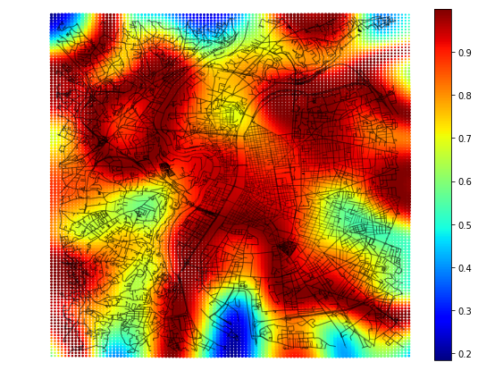
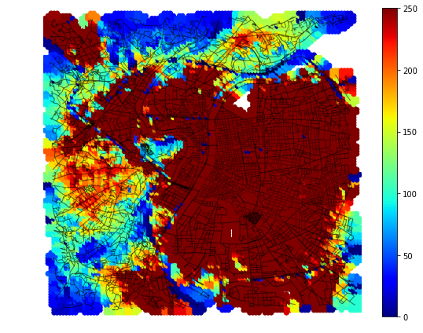
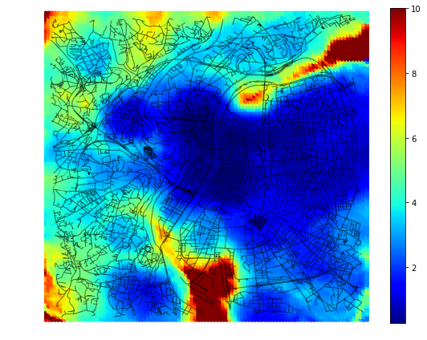
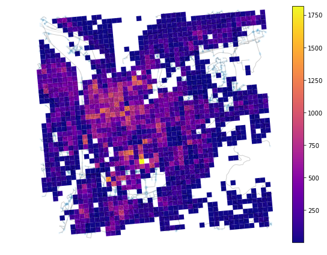
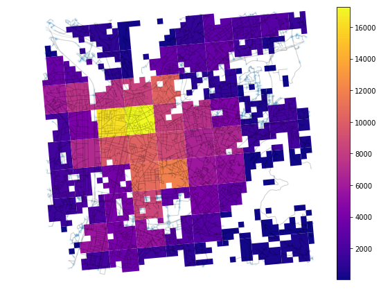

# Urbansprawl

The urbansprawl project provides an open framework to assess the urban sprawl phenomenon.
It uses OpenStreetMap data to calculate its sprawling indices, divided in Accessibility, Land use mix, and Dispersion.

Additionally, it provides the tools to perform dissagregated population estimates at building level using open data.

**For more details, refer to:**

* Gervasoni Luciano, Bosch Martí, Fenet Serge, and Sturm Peter. 2016. "[A framework for evaluating urban land use mix from crowd-sourcing data](https://hal.inria.fr/hal-01396792)." 2nd International Workshop on Big Data for Sustainable Development.

* Gervasoni Luciano, Bosch Martí, Fenet Serge, and Sturm Peter. 2017. "[LUM_OSM: une plateforme pour l'évaluation de la mixité urbaine à partir de données participatives](https://hal.inria.fr/hal-01548341)." GAST Workshop, Conférence Extraction et Gestion de Connaissances (EGC 2017).

* Gervasoni Luciano, Bosch Martí, Fenet Serge, and Sturm Peter. 2017. "[Calculating spatial urban sprawl indices using open data](https://hal.inria.fr/hal-01535469)." 15th International Conference on Computers in Urban Planning and Urban Management.

* Gervasoni Luciano, Fenet Serge, and Sturm Peter. 2018. "[Une méthode pour l’estimation désagrégée de données de population à l’aide de données ouvertes](https://hal.inria.fr/hal-01667975)." Conférence Internationale sur l'Extraction et la Gestion des Connaissances (EGC 2018).


## Dependencies

urbansprawl works with Python 2+3.

- Python dependencies:
```sh
osmnx scikit-learn
```

* Using anaconda:
```sh
conda update -c conda-forge --all
conda install -c conda-forge osmnx scikit-learn
```

## Example: Urban sprawl

OpenStreetMap data is retrieved using the Overpass API.

Results are depicted for the city of **Lyon, France**:

- Locations of residential and activity land uses are retrieved

* Buildings with defined land use:
	* Blue: Residential use
	* Red: Activity use
	* Green: Mixed use


* Points of interest (POIs) with defined land use:



- Densities for each land use are estimated:



* Activity uses can be further classified:



- Street network:



**Sprawling indices:**

- Land use mix indices:



- Accessibility indices:



- Dispersion indices:



## Example: Population densities

Gridded population data is used in the context of population densities downscaling.

Population count images are depicted for the city of **Grenoble, France**:

- Population densities (INSEE census data):



- Population densities (INSEE census data, Gridded Population World resolution):


