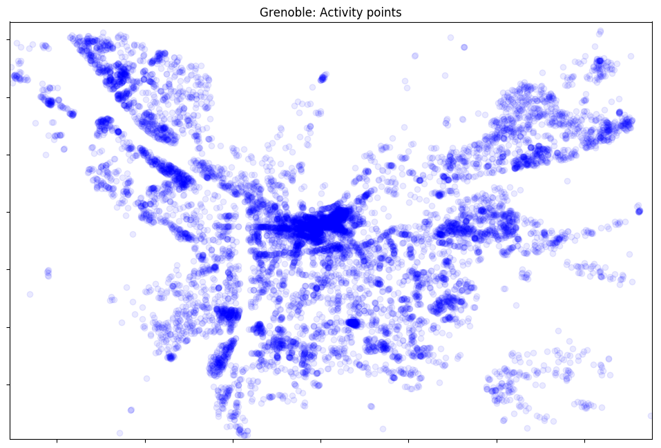
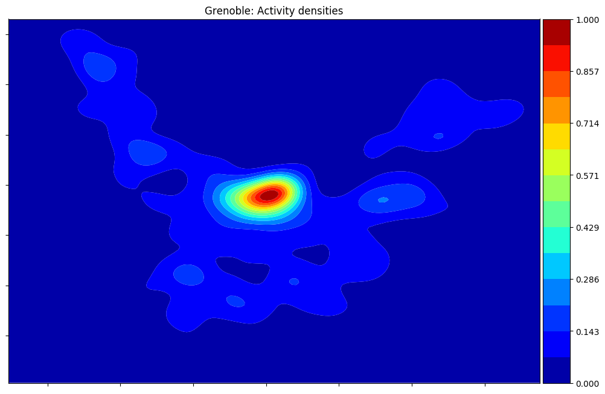
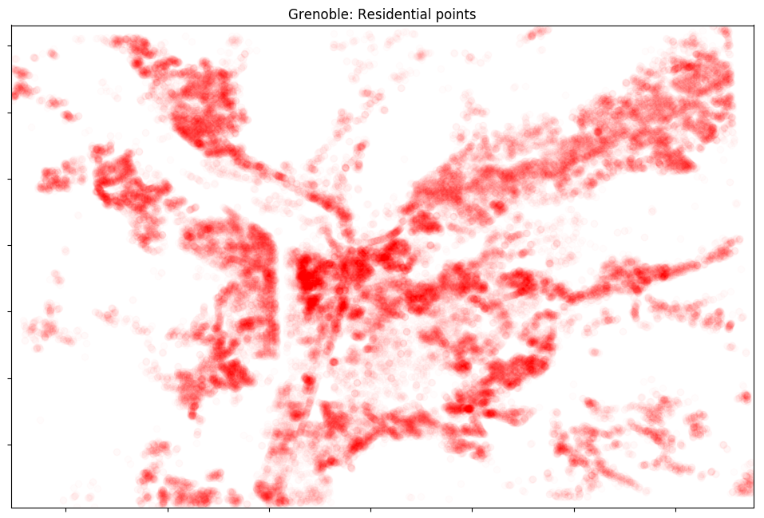
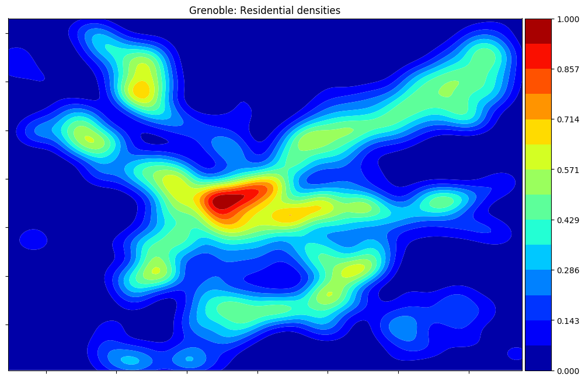
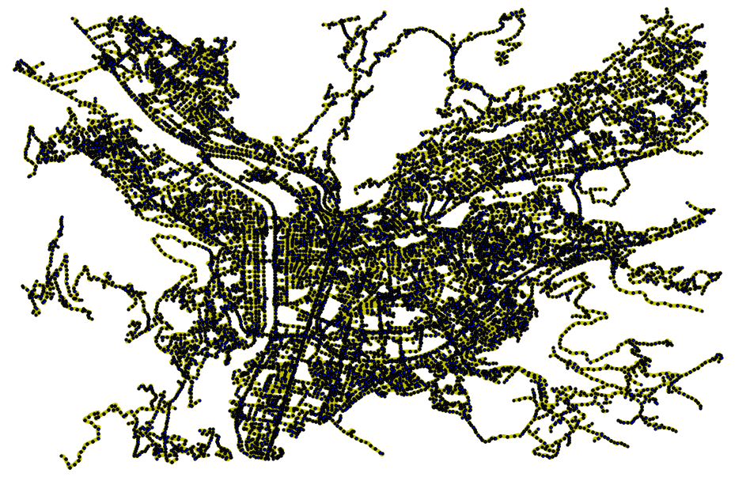
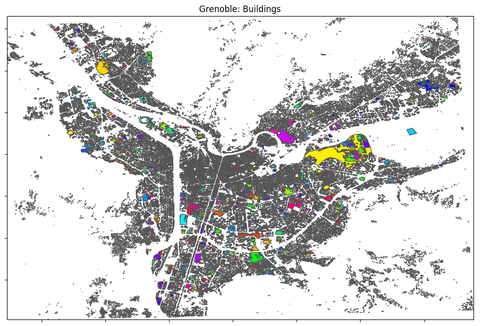
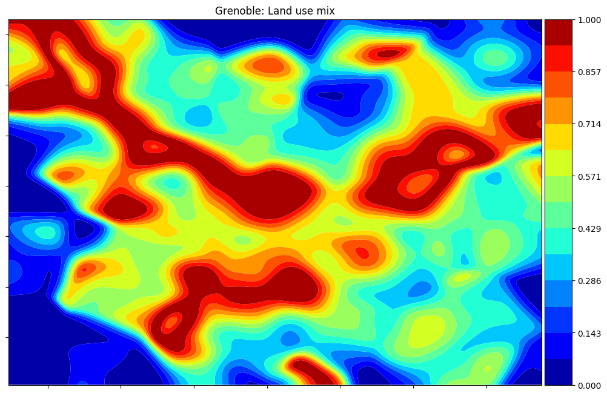
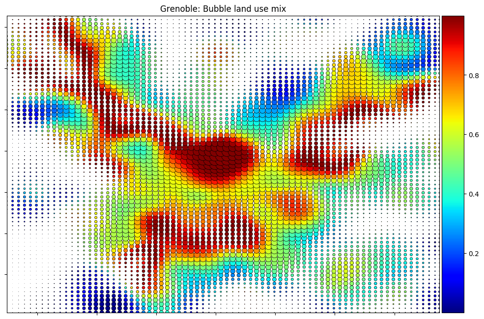
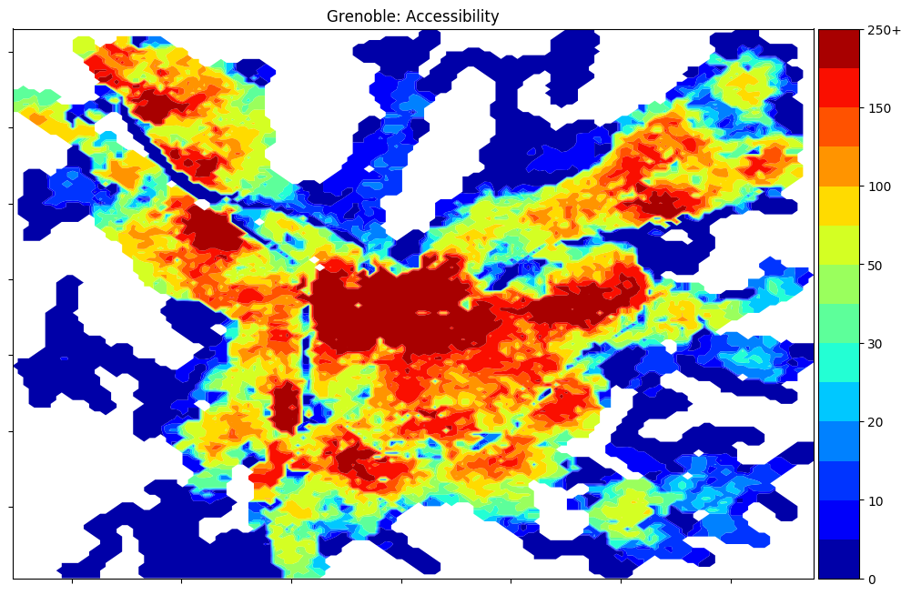
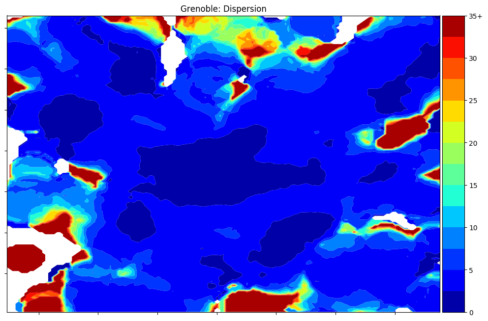

# Urbansprawl

The urbansprawl project provides an open framework to assess the urban sprawl phenomenon.
It uses OpenStreetMap data to calculate its sprawling indices, divided in Accessibility, Land use mix, and Dispersion.


**For more details, refer to:**

* Gervasoni Luciano, Bosch Martí, Fenet Serge, and Sturm Peter. 2016. "[A framework for evaluating urban land use mix from crowd-sourcing data](https://hal.inria.fr/hal-01396792)." 2nd International Workshop on Big Data for Sustainable Development.

* Gervasoni Luciano, Bosch Martí, Fenet Serge, and Sturm Peter. 2017. "[LUM_OSM: une plateforme pour l'évaluation de la mixité urbaine à partir de données participatives](https://hal.inria.fr/hal-01548341)." GAST Workshop, Conférence Extraction et Gestion de Connaissances (EGC 2017).

* Gervasoni Luciano, Bosch Martí, Fenet Serge, and Sturm Peter. 2017. "[Calculating spatial urban sprawl indices using
open data](https://hal.inria.fr/hal-01535469)." 15th International Conference on Computers in Urban Planning and Urban Management.

## Dependencies

urbansprawl works with Python 2+3.

- Python dependencies:
```sh
osmnx utm scipy statsmodels h5py
```

* Using anaconda:
```sh
conda update -c conda-forge --all
conda install -c conda-forge osmnx utm scipy statsmodels h5py
```

## Example

PostGIS-enabled PostgreSQL databases are used in this framework (refer to [OSM2PGSQL tools](https://mapzen.com/data/metro-extracts/)):

Results are depicted for the city of **Grenoble, France**:

- Locations and densities of residential and activity land usages






- Street network



- Buildings



**Sprawling indices:**

- Land use mix indices




- Accessibility indices



- Dispersion indices


